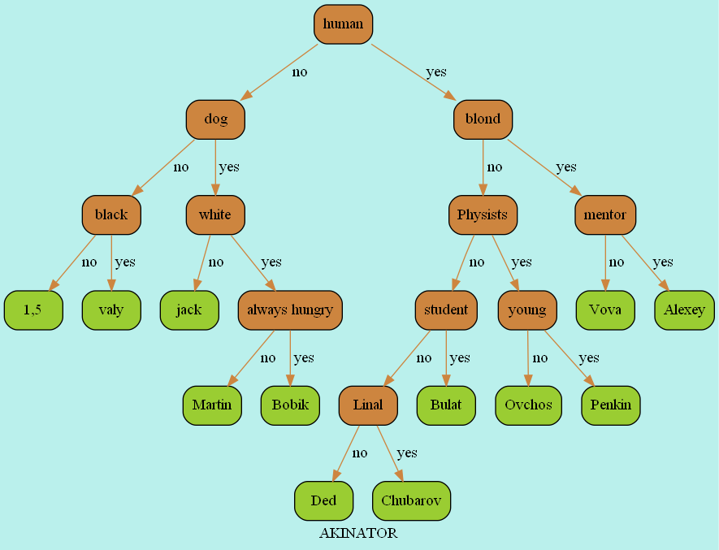

Below is a README file for the "Acinator" program based on the provided files:

---

# Acinator

## Table of Contents
- [Overview](#Overview)
- [Files Included](#Files-Included)
- [How to Compile](#how-to-compile)
- [Running the Program](#Running-the-Program)
- [Usage](#usage)
- [Building Graphviz](#Building-Graphviz)
- [Additional Notes](#additional-notes)
- [Dependencies](#Dependencies)

---

## Overview
"Acinator" is a simple program that implements a binary tree data structure to play a guessing game similar to the Akinator game. It allows users to play, find elements in the tree, compare nodes, and add new data to the database.

## Files Included
- **acinator.cpp**: Contains the main logic of the "Acinator" program, including functions to run the game, play, find elements, compare nodes, and manage the tree.
- **acinator.h**: Header file defining the structures and function prototypes used in "Acinator".
- **input_output.cpp**: Handles input and output operations such as reading data from files, constructing the tree, and building the tree in Graphviz format.
- **main.cpp**: Main entry point of the program where the "Acinator" game is executed.
- **tree.cpp**: Implements functions related to the binary tree operations such as insertion, searching, and destruction.
- **stack_path.cpp**: Provides a stack implementation for storing paths in the tree.
- **stack.cpp**: Implements a stack for storing elements in the tree traversal process.
- **DSL.h**: Contains common macros and definitions used across the program.

## How to Compile
To compile the "Acinator" program, use the following commands (with Makefile):
```bash
all: tree
	tree.exe file_output.txt
	dot -Tpng graphviz\graph.dot -o graphviz\tree_graph.png
	start graphviz\tree_graph.png

tree: src\main.cpp src\tree.cpp src\acinator.cpp src\input_output.cpp stack\src\stack.cpp stack\src\stack_path.cpp
	g++ -o tree src\main.cpp src\tree.cpp stack\src\stack.cpp stack\src\stack_path.cpp src\acinator.cpp src\input_output.cpp


```

## Running the Program
After compilation, run the program using:
```bash
./acinator file_output.txt
```
- `file_output.txt` is the file containing the initial database for the "Acinator" game.

## Usage
- The program provides options to play the guessing game ('p'), find an element ('f'), compare two nodes ('c'), or stop ('s').
- When playing, the program asks questions to narrow down the answer until it makes a guess.
- Users can also find information about a specific element in the tree or compare two nodes to see their paths.

## Building Graphviz
The program can build a Graphviz visualization of the binary tree. The resulting graph is stored in "graphviz/graph.dot".
---

---
## Dependencies
- The program uses standard C libraries like `stdio.h`, `stdlib.h`, `string.h`, and `assert.h`.
- Graphviz (optional) is needed to generate a visualization of the binary tree.

## Credits
This program was created as a project for learning purposes.

---

This README provides an overview of the "Acinator" program, its files, compilation, usage, and other relevant information. Please adjust the details as needed for your specific implementation.
